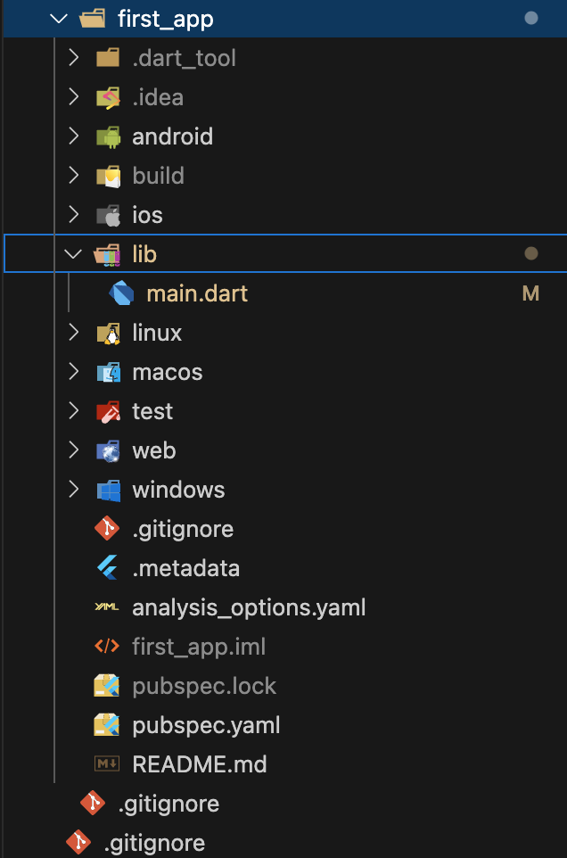

```bash
 ____  _  _  ____  ____  ____  ____  ____  ____  ____  ____ 
(  _ \/ )( \(_  _)(_  _)(  __)(  _ \(  __)(  _ \(  __)(  __)
 ) _ () \/ (  )(    )(   ) _)  )   / ) _)  )   / ) _)  ) _) 
(____/\____/ (__)  (__) (____)(__\_)(__)  (__\_)(____)(____)
```

> flutter tryouts.

# Introduction

`flutter` itself is a framework that uses the language `dart` (made by google). One of the main advantages of `flutter` is that there is a single source code that can be used to create applications on various platforms and operating systems.


# Flutter Setup (WIP)

I am using a mac, so mine will mostly be based on how to set it up as mac.
`flutter` can be used to build many type of apps, but as the recommendation is `ios`, I will followed guide for iOS apps. I am also going to download `android` related stuff just in case.

I am following the official guide from flutter.dev page here: https://docs.flutter.dev/get-started/install/macos/mobile-ios

## Install dependencies

To work with `flutter` on mac OS. The following must be installed:

- `rosetta` (If you are using a macbook that is Apple silicon based)
- `xcode`
- `cocoapods`

### install rosetta

`rosetta` is needed to support stuff(?) that is not arm64 based

```bash
sudo softwareupdate --install-rosetta --agree-to-license
```

### install xcode

I am not a big fan, but if you are buildin iOS app, this is a must.

xcode can be downloaded from [here](https://developer.apple.com/xcode/)


### install cocoapods

install cocoapods. 

```bash
sudo gem install cocoapods

# you can also use brew (this might be a better solution)
brew install cocoapods
``` 

## Install `flutter` SDK

Download flutter SDK from the website. Currently, the direction provided in the website is to manually install it by unzipping it and _adding it to `PATH`_

### Install SDKs

Depending on what platform you're building on, you will need the related SDKs and tools. For example, if you are working on building apps on `iOS`, you will need `XCode`, along with `iOS SDK`.

For **android**, you will need `Android SDK` and related tools (Easiest is to install everything with `Android Studio`).

## Quick Check

Once everything is correctly set up (more like downloaded), you can check with `flutter doctor` command.

```bash
% flutter doctor                                                                                                                                        Doctor summary (to see all details, run flutter doctor -v):
[✓] Flutter (Channel stable, 3.22.3, on macOS 14.5 23F79 darwin-arm64, locale en-KR)
[✓] Android toolchain - develop for Android devices (Android SDK version 35.0.0)
[✓] Xcode - develop for iOS and macOS (Xcode 15.4)
[✓] Chrome - develop for the web
[✓] Android Studio (version 2024.1)
[✓] IntelliJ IDEA Ultimate Edition (version 2023.2.7)
[✓] VS Code (version 1.91.1)
[✓] Connected device (3 available)
[✓] Network resources

• No issues found!
```

> ⚠️ If you run into issues with Android toolchain, make sure to deal with `android license agreement`.

# Creating a flutter app

Creating an app can be done using the `flutter` cli tool. 

```bash
$ flutter create app
```

This will create a directory that conatains files that are needed to run the app.

## diving into the project structure



- `lib` : contains `main.dart` file.
  + contains `dart` files, because we are writing in `dart` for `flutter`
- `android`,`ios`,`macos`, etc. : these are platform specifc codes, usually maintained by `flutter`. It becomes more important when actualyl _deploying_.
- `build` : temp build files
- `test` : test code location
- `analysis_options.yaml` : it has linters, styles.. 
- `pubspec.yaml` : can be used to add third-party packages. 

# Material Design

`flutter` uses [`material design`](https://m2.material.io/design) by default. (by google)


### notes

https://github.com/academind/flutter-complete-guide-course-resources
